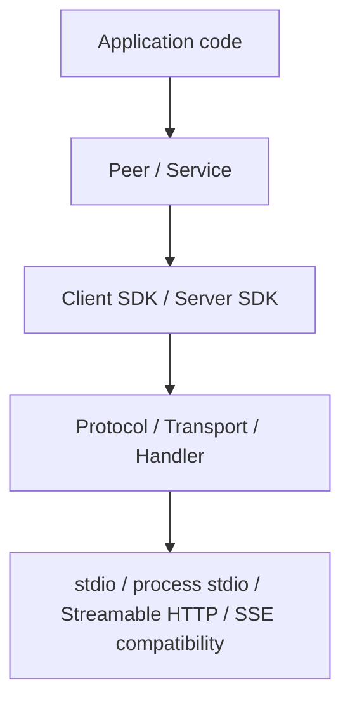

# cxxmcp

[](https://isocpp.org/)
[](https://cmake.org/)
[](https://github.com/caomengxuan666/cxxmcp/actions/workflows/release-gates.yml)
[](https://caomengxuan666.github.io/cxxmcp/)
[](LICENSE)
[](https://modelcontextprotocol.io/)
[](#quick-install)

`cxxmcp` is a modern C++17 SDK for building
[Model Context Protocol](https://modelcontextprotocol.io/) clients and servers
in native C++ applications.

Use it to expose local tools over MCP, connect to existing MCP servers, or embed
typed MCP protocol support into your own client/server process without adopting
an additional hosting layer.

Read this in [Chinese](README_zh.md).

## Start Here

| I want to... | Use |
|---|---|
| Build an MCP server with typed tools | `cxxmcp::server` and `mcp::ServerPeer` |
| Connect to an MCP server | `cxxmcp::client` and `mcp::ClientPeer` |
| Share protocol DTOs or JSON-RPC helpers | `cxxmcp::protocol` |
| Use the complete SDK surface | `cxxmcp::sdk` |

The public SDK surface is intentionally narrow and package-friendly:
`protocol`, `transport`, `handler`, `peer`, `service`, `client`, and `server`
are the core library layers. Tooling and application hosting stay outside the
core SDK contract.

## Contents

- [Why cxxmcp](#why-cxxmcp)
- [Quick Install](#quick-install)
- [Quick Start](#quick-start)
- [Capability Snapshot](#capability-snapshot)
- [SDK Map](#sdk-map)
- [Quality Signals](#quality-signals)
- [Using As A Library](#using-as-a-library)
- [Build From Source](#build-from-source)
- [Package Targets](#package-targets)
- [Protocol Boundary](#protocol-boundary)
- [Capability Classification](#capability-classification)
- [HTTP Transport Policy](#http-transport-policy)
- [Compatibility Contract](#compatibility-contract)
- [Examples](#examples)
- [Release Evidence](#release-evidence)
- [Documentation](#documentation)
- [Project Status](#project-status)

## Why cxxmcp

- Normal CMake consumption with `find_package(cxxmcp CONFIG REQUIRED)`
- C++17 public SDK targets with typed MCP protocol models
- Embeddable client and server libraries for real C++ applications
- RMCP-style `Peer`, `Service`, and handler boundaries for SDK-first authoring
- stdio, process stdio, Streamable HTTP, and legacy SSE-compatible transport
  paths
- Typed tool, prompt, resource, completion, elicitation, sampling, task,
  progress, and cancellation surfaces
- Raw JSON-RPC escape hatches for vendor-specific or future MCP behavior
- Package-smoke and cross-SDK interoperability tests used as release gates

## Quick Install

If cxxmcp is installed into a CMake prefix, downstream use is the usual SDK
flow:

```cmake
find_package(cxxmcp CONFIG REQUIRED)

add_executable(my_server server.cpp)
target_link_libraries(my_server PRIVATE cxxmcp::server)

add_executable(my_client client.cpp)
target_link_libraries(my_client PRIVATE cxxmcp::client)
```

Build and install a local SDK package from this checkout:

```powershell
cmake -S . -B build -DCXXMCP_BUILD_CLIENT=ON -DCXXMCP_BUILD_SERVER=ON
cmake --build build --config Release
cmake --install build --config Release --prefix out/install/cxxmcp
```

Public SDK headers and package targets are C++17. Repository-local examples,
tests, and documentation checks may require C++20.

Package-manager work starts from the SDK-only contract:

- Conan 2 recipe: `conanfile.py`
- vcpkg overlay port: `packaging/vcpkg/ports/cxxmcp`
- xmake-repo recipe draft: `packaging/xmake/packages/c/cxxmcp/xmake.lua`
- FetchContent / CPM.cmake snippets:
  [Package consumption](docs/package_consumption.md). CPM users provide or
  bootstrap their own `CPM.cmake`; cxxmcp does not install that helper.

These paths build only the C++17 SDK targets from this repository.
The vcpkg port is an overlay port for this checkout:

```powershell
vcpkg install cxxmcp --overlay-ports=C:\path\to\MCPServer.cpp\packaging\vcpkg\ports
```

Manifest-mode projects can use
`packaging/vcpkg/vcpkg-configuration.overlay-example.json` as a starting point
and pin their own vcpkg `builtin-baseline`. cxxmcp is not in the curated
registry today; a future registry port will need a release tag, SHA512 source
archive hash, triplet-controlled linkage, and the same SDK-only dependency
contract.

## Quick Start

Start with the normal CMake target for the side you are building:

```cmake
find_package(cxxmcp CONFIG REQUIRED)

add_executable(my_mcp_server server.cpp)
target_link_libraries(my_mcp_server PRIVATE cxxmcp::server)
```

Then create a peer, register typed handlers, and serve it over a transport:

```cpp
#include <utility>

#include <cxxmcp/peer.hpp>
#include <cxxmcp/server.hpp>
#include <cxxmcp/service.hpp>

int main() {
    auto peer = mcp::ServerPeer::builder()
        .name("demo-server")
        .version("1.0.0")
        .stdio()
        .tool(mcp::server::tool<mcp::protocol::Json, mcp::protocol::Json>("echo")
            .description("Echo the incoming payload")
            .handler([](const mcp::protocol::Json& input) {
                return mcp::protocol::Json{{"echo", input}};
            }))
        .build();

    if (!peer) {
        return 1;
    }

    auto running = mcp::serve(std::move(*peer));
    return running ? (running->wait().has_value() ? 0 : 1) : 1;
}
```

For client code and lower-level transport examples, see
[Complete Peer/Service Examples](#complete-peerservice-examples).

## Capability Snapshot

| Area | Status |
|---|---|
| Protocol and JSON-RPC | Typed models, serialization helpers, initialize version validation, raw request/notification escape hatches |
| Client SDK | HTTP, stdio, process-stdio, request handles, typed async helpers, roots, sampling, elicitation, tasks |
| Server SDK | Registries, typed tool helpers, prompt/resource handlers, task-aware tool calls, notifications |
| Peer/service boundary | RMCP-like role-aware `Peer<Role>` and `Service<Role>` public shape |
| Transports | stdio, process stdio, Streamable HTTP, legacy SSE compatibility paths |
| Packaging | Exported CMake targets, install tree support, package-smoke fixture |

## SDK Map



## Quality Signals

- Release gates cover public headers, package-smoke consumption, transports,
  SDK behavior, and RMCP / TypeScript / Python interoperability.
- Release candidates are expected to publish workflow artifacts, Doxygen API
  docs, source archives, checksums, and release evidence for the exact commit.
- Compatibility expectations are tracked in
  [Compatibility policy](docs/compatibility_policy.md) and
  [Release gates](docs/release_gates.md).
- The official SDK candidate path is tracked in
  [Official SDK candidate process](docs/official_sdk_candidate_process.md).

Project status: `cxxmcp` is a community C++ MCP SDK preparing official SDK
candidate evidence. It is not an official MCP SDK unless accepted or listed by
the MCP maintainers.

## Using As A Library

Installed-package usage should look like a normal CMake SDK:

`Peer` and `Service` remain the application entry points. The `client` and
`server` package targets provide the embeddable SDK layers behind those entry
points, not a separate first-choice architecture.

```cmake
find_package(cxxmcp CONFIG REQUIRED)

add_executable(my_client main.cpp)
target_link_libraries(my_client PRIVATE cxxmcp::client)

add_executable(my_server server.cpp)
target_link_libraries(my_server PRIVATE cxxmcp::server)
```

Use `cxxmcp::sdk` when one target should pull in the public protocol, client,
and server SDK layers.

The package, repository, installed include path, and CMake targets use the
`cxxmcp` name. The C++ namespace is intentionally `mcp` and is part of the
stable source API; it should not be renamed inside a stable major release line.

Common public headers:

```cpp
#include <cxxmcp/protocol.hpp>
#include <cxxmcp/request.hpp>
#include <cxxmcp/transport.hpp>
#include <cxxmcp/handler.hpp>
#include <cxxmcp/peer.hpp>
#include <cxxmcp/service.hpp>
#include <cxxmcp/client.hpp>
#include <cxxmcp/server.hpp>
#include <cxxmcp/sdk.hpp>
```

## Build From Source

Requirements:

- CMake 3.23+
- A C++17 compiler for SDK targets
- A C++20 compiler when building examples or tests

Default SDK build:

```powershell
cmake -S . -B build
cmake --build build
```

Build client and server SDKs explicitly:

```powershell
cmake -S . -B build-sdk -DCXXMCP_BUILD_CLIENT=ON -DCXXMCP_BUILD_SERVER=ON
cmake --build build-sdk
```

Build examples:

```powershell
cmake --preset examples
cmake --build --preset examples
ctest --preset examples
```

Build and run the full smoke test set:

```powershell
cmake -S . -B build-smoke -DCXXMCP_BUILD_SDK=ON -DCXXMCP_BUILD_CLIENT=ON -DCXXMCP_BUILD_SERVER=ON -DCXXMCP_BUILD_TESTS=ON
cmake --build build-smoke --config Debug
ctest --test-dir build-smoke -C Debug --output-on-failure
```

Install to a local prefix:

```powershell
cmake --install build-smoke --config Debug --prefix out/install/cxxmcp
```

## Complete Peer/Service Examples

### Canonical Server Peer/Service

```cpp
#include <iostream>
#include <utility>

#include <cxxmcp/peer.hpp>
#include <cxxmcp/service.hpp>

int main() {
    auto peer = mcp::ServerPeer::builder()
        .name("demo-server")
        .version("1.0.0")
        .stdio()
        .tool(mcp::server::tool<mcp::protocol::Json, mcp::protocol::Json>("echo")
            .description("Echo the incoming payload")
            .handler([](const mcp::protocol::Json& input) {
                return mcp::protocol::Json{{"echo", input}};
            }))
        .build();

    if (!peer) {
        return 1;
    }

    auto running = mcp::serve(std::move(*peer));
    if (!running) {
        return 1;
    }
    return running->wait().has_value() ? 0 : 1;
}
```

### Canonical Client Peer/Service

```cpp
#include <memory>
#include <utility>

#include <cxxmcp/peer.hpp>
#include <cxxmcp/service.hpp>
#include <cxxmcp/transport/http_transport.hpp>

int main() {
    auto transport =
        std::make_unique<mcp::transport::StreamableHttpClientTransport>(
            mcp::transport::StreamableHttpClientTransportOptions{
                .host = "127.0.0.1",
                .port = 3000,
                .path = "/mcp",
            });
    mcp::ClientPeer peer(std::move(transport));

    auto running = mcp::serve(std::move(peer));
    if (!running) {
        return 1;
    }

    running->peer().initialize();
    running->peer().list_all_tools();
    running->peer().call_tool("echo", mcp::protocol::Json{{"value", "hello"}});
    running->stop();
}
```

### Compatibility App Builder

The `server::App::builder()` path is a convenience wrapper for compact demos and
legacy code. New SDK documentation and examples should use `Peer` and `Service`
first.

```cpp
#include <string>

#include <cxxmcp/server.hpp>

int main() {
    return mcp::server::App::builder()
        .name("demo-server")
        .version("1.0.0")
        .instructions("Expose local tools over MCP.")
        .stdio()
        .tool<std::string, std::string>("echo", [](const std::string& text) {
            return text;
        })
        .run();
}
```

## Package Targets

| Target | Purpose |
|---|---|
| `cxxmcp::protocol` | MCP protocol models and JSON-RPC serialization |
| `cxxmcp::transport` | Role-generic transport contracts and shared transport helpers |
| `cxxmcp::handler` | Client/server handler interfaces and aggregates |
| `cxxmcp::peer` | Role-aware client/server execution boundary |
| `cxxmcp::service` | Service lifecycle boundary around peers |
| `cxxmcp::client` | Embeddable MCP client SDK |
| `cxxmcp::server` | Embeddable MCP server SDK |
| `cxxmcp::auth` | Optional OAuth 2.1 / DPoP contract scaffold when `CXXMCP_ENABLE_AUTH=ON` |
| `cxxmcp::sdk` | Aggregate public SDK target |
| `cxxmcp::plugin_sdk` | Optional plugin authoring surface |
| `cxxmcp::adapters` | Optional adapter helpers |

Gateway/runtime/CLI tooling lives outside this SDK repository. The in-tree
`plugin_sdk` and `adapters` targets are optional SDK-adjacent surfaces, not
first-choice SDK entry points.

## Protocol Boundary

cxxmcp follows the MCP JSON-RPC wire shape. It does not define a custom MCP
dialect or alternate wire format. Normal application code should use typed
helpers for tools, prompts, resources, completion, roots, sampling,
elicitation, tasks, progress, and cancellation. Raw JSON-RPC request and
notification APIs remain available for vendor-specific methods, forward
compatibility, and conformance tests. Unusual host integrations should be
implemented through compatibility adapters over the public transport contracts,
not by extending the protocol.

Tasks and elicitation are exposed as typed SDK capabilities, but they remain
optional feature families. A milestone that targets core MCP parity must not
force applications to implement task or elicitation handlers unless that
milestone explicitly covers those capabilities. Capability negotiation and raw
JSON-RPC escape hatches remain the compatibility path for partial or future
feature support. Server-side task and elicitation lifecycle semantics are documented in
[Capability lifecycles](docs/capability_lifecycles.md). Request timeout,
cancellation, progress, and shutdown semantics are documented in
[Request lifecycle](docs/request_lifecycle.md).

## Capability Classification

cxxmcp treats protocol capabilities as negotiated contracts, not as global
feature promises. Once `initialize` capabilities are known, typed helpers fail
locally with a protocol error instead of sending a method that the peer did not
advertise. Raw JSON-RPC APIs remain available for vendor extensions and future
protocol fields.

| Classification | Capability families | SDK rule |
|---|---|---|
| Core protocol | initialize, initialized, ping, JSON-RPC errors, raw request/notification escape hatches, cancellation, progress, and the typed model/serialization layer | Always part of the SDK contract. These are not optional product features, though individual transports may still report transport-level failures. |
| Core advertised server features | tools, prompts, resources, resource templates, completion, logging, resource subscribe/unsubscribe | Public typed helpers are stable. Helpers that depend on advertised server capabilities are gated after initialize. |
| Core advertised client features | roots, sampling, elicitation, cancellation and progress callbacks | Public typed handlers/helpers are stable. Server-side `ClientPeer` helpers are gated by the connected client's negotiated capabilities. |
| Optional task lifecycle | task-aware tool calls, task list/get/cancel/result, task status notifications, task request parameters on supported feature calls | Stable typed protocol models and helpers exist, but applications only need to implement them when they advertise or require task support. |
| Optional advanced interaction | elicitation form/URL flows and sampling details beyond basic request handling | Stable typed helpers exist, but implementations should keep them capability-gated and document user-facing behavior. |
| Experimental or vendor extension | `experimental`, `extensions`, unknown JSON members, and vendor-specific methods | Raw JSON is preserved where modeled. Semantics are not guaranteed as stable SDK behavior until promoted into a documented capability family. |

## Protocol Version Policy

cxxmcp tracks published MCP protocol snapshots and does not mint custom
versions. The SDK advertises and validates only versions listed by
`protocol::supported_protocol_versions()`.

When a new MCP snapshot is added, cxxmcp keeps the previous supported snapshot
for at least one minor release so clients and servers can overlap during
rollout. Dropping a snapshot is a breaking compatibility event and must be
called out in release notes and the public compatibility checklist.

Unsupported versions fail fast with a protocol or transport validation error;
the SDK does not silently negotiate down to an unadvertised dialect. HTTP
requests additionally require `MCP-Protocol-Version` after initialize, and
initialize requests with mismatched header/body versions are rejected.

## HTTP Transport Policy

Streamable HTTP is the default HTTP path. The server transport currently runs in
stateful mode: each successful `initialize` creates a distinct
`Mcp-Session-Id`, and later POST, GET/SSE, and DELETE requests must send that
session id plus `MCP-Protocol-Version`. Unknown or deleted sessions are treated
as stale and rejected.

Stateless server mode is not currently advertised by `server::HttpTransport`.
Servers that need Streamable HTTP in this SDK should use the stateful session
contract above. The client transport can still consume simple HTTP MCP
endpoints that do not return `Mcp-Session-Id`; in that case it omits session
headers and treats each POST response independently.

Server-to-client requests, notifications, client capabilities, replay windows,
and pending responses are tracked per session. `SessionContext::client()` binds
the returned `ClientPeer` to the active session, so roots, sampling,
elicitation, cancellation, and progress notifications are routed to the correct
HTTP client. One live real-time SSE stream is accepted per session; reconnects
with `Last-Event-ID` can replay retained events while an old stream is closing.

HTTP auth is intentionally exposed as SDK contracts rather than a bundled
identity provider. Server applications can install `server::AuthProvider`; the
Streamable HTTP transport passes request headers into `SessionContext`, stores a
successful `AuthIdentity`, and maps auth-category failures to
`401 Unauthorized` with `HttpTransportOptions::auth_challenge` as the
`WWW-Authenticate` value. Client transports can set fixed request headers and a
bearer token through `StreamableHttpClientTransportOptions`; the bearer helper
is applied to POST, SSE GET, and session DELETE requests unless an explicit
`Authorization` header is already present. The fuller OAuth 2.1 / DPoP
direction is tracked in [Auth design](docs/auth_design.md).

Legacy SSE compatibility is compatibility-only. New code should use the
Streamable HTTP POST/GET/DELETE behavior and treat raw SSE endpoints as an
adapter concern, not a separate SDK protocol.

The current `cpp-httplib` backend decision and replacement trigger are tracked
in `docs/compatibility_policy.md#http-transport-backend-evidence`.

## CMake Options

| Option | Default | Description |
|---|---:|---|
| `CXXMCP_BUILD_SDK` | `ON` | Build the aggregate public SDK layer |
| `CXXMCP_BUILD_PROTOCOL` | `ON` | Build the MCP protocol library |
| `CXXMCP_BUILD_CLIENT` | `OFF` | Build the MCP client library |
| `CXXMCP_BUILD_SERVER` | `OFF` | Build the MCP server library |
| `CXXMCP_BUILD_EXAMPLES` | `OFF` | Build example executables |
| `CXXMCP_BUILD_TESTS` | `BUILD_TESTING` | Build tests for enabled layers |
| `CXXMCP_BUILD_DOCS` | `OFF` | Build Doxygen API documentation |
| `CXXMCP_ENABLE_AUTH` | `OFF` | Build the optional OAuth 2.1 / DPoP auth contract target |

`CXXMCP_BUILD_SDK` enables the protocol, client, and server layers.

## Async Request Executor

Async request helpers use a small process-wide bounded worker pool. The default
is 4 workers with a queue size of 64, which is intended for local
stdio/process-stdio MCP workloads. Gateway, remote HTTP, or high-concurrency
applications may configure it before the first async request:

```cpp
mcp::configure_request_executor(
    mcp::RequestExecutorOptions{.worker_count = 8, .max_queue_size = 256});
```

Reconfiguration after the executor has been initialized is rejected so in-flight
request semantics remain stable.

## Compatibility Contract

- Public SDK headers and package targets compile as C++17 by default. The
  configurable `CXXMCP_SDK_CXX_STANDARD` cache value may be raised by a
  downstream build, but public headers must not require it.
- The release compiler matrix is Windows/MSVC, Linux/GCC, Linux/Clang, and
  macOS/AppleClang. A release may only claim support for matrix entries that
  passed the public-header, package-smoke, and conformance gates for that
  release.
- MinGW UCRT64 GCC and MinGW CLANG64 Clang are provisional best-effort
  compatibility evidence from the scheduled `compiler-compat` workflow, not
  release-supported targets, while their jobs remain `continue-on-error`.
- Public include paths stay under `cxxmcp/...`; public targets are
  `cxxmcp::protocol`, `cxxmcp::transport`, `cxxmcp::handler`,
  `cxxmcp::peer`, `cxxmcp::service`, `cxxmcp::client`, `cxxmcp::server`, and
  `cxxmcp::sdk`.
- Source compatibility follows semantic versioning. Public renames must add the
  new name first, keep the old alias with `CXXMCP_DEPRECATED("message")`,
  document the migration, and remove the alias only in the next major release.
- ABI stability is explicitly out of scope while cxxmcp ships static libraries
  by default. A shared-library ABI policy must be defined before treating shared
  builds as stable release artifacts.
- Release review must include a public header diff, independent public-header
  compile tests, installed-tree `package_smoke`, and the conformance matrix
  available for that release.
- The full compatibility policy is tracked in
  [Compatibility policy](docs/compatibility_policy.md). Release-blocking tests,
  labels, and the supported compiler/generator/runtime matrix are tracked in
  [Release gates](docs/release_gates.md).

## Examples

The in-tree examples preset builds compact SDK entry points:

- First-choice Peer/Service examples: `auth_bearer_http`,
  `server_stdio_peer`, `server_peer`, `client_peer`, `process_stdio_client`,
  `timeout_cancellation`, `elicitation_client`
- Focused capability examples: `auth_dpop_openssl`, `handler_contracts`,
  `task_async_client_server`, `typed_stdio_server`, `streamable_http_client`
- Compatibility and low-level examples: `stdio_server`, `client_loopback`
`ctest --preset examples` runs only self-contained smoke examples. Long-running
stdio servers and external Streamable HTTP samples are build-checked but not run
as standalone CTest cases.

The example taxonomy is maintained in `docs/examples.md`.

The separate
[cxxmcp-examples](https://github.com/caomengxuan666/cxxmcp-examples)
repository is the downstream, application-style validation suite. It exercises
the SDK through a normal external CMake project and covers advanced surfaces
that are intentionally broader than the compact in-tree samples: direct
Streamable HTTP and legacy SSE, process stdio, custom transports, transport
adapters, async request handles, cursor pagination, subscriptions,
server-to-client callbacks, HTTP auth-lite, tasks and cancellation, and
plugin/adapters.

## Quality Bar

The repository keeps SDK-grade checks close to the source tree:

- protocol, client/server, transport, SDK, and public target tests
- package-smoke fixture for installed CMake target consumption
- local RMCP conformance coverage
- examples build preset
- formatting, cpplint, clang-tidy, Doxygen, and release-evidence scripts

Current standardization work is tracked in [Fact-standard TODO](todo.md).

## Release Evidence

A release may claim support only for compiler, generator, runtime-library, and
platform combinations where the release-blocking set passed for the release
commit. The release evidence package is expected to include:

- `cxxmcp-release-gates-*` workflow artifacts with CTest logs and JUnit output
- `cxxmcp-doxygen-html` API documentation
- `cxxmcp-source` source archive plus `SHA256SUMS.txt`
- `cxxmcp-release-evidence` with README, changelog, compatibility policy,
  release gates, checklist, notes template, TODO, and examples

Interop evidence is anchored by RMCP conformance coverage and process-stdio
fixtures for RMCP, TypeScript SDK, and Python SDK clients.

## Documentation

- [GitHub Pages documentation](https://caomengxuan666.github.io/cxxmcp/)
- [Fact-standard TODO](todo.md)
- [Contributing](CONTRIBUTING.md)
- [Security policy](SECURITY.md)
- [Compatibility policy](docs/compatibility_policy.md)
- [Dependency and reference policy](docs/dependency_policy.md)
- External gateway boundary: `docs/runtime_gateway.md`
- [Protocol model audit](docs/protocol_model_audit.md)
- [External consumer template](templates/external_consumer)
- [Release process](docs/release_process.md)
- [Release gates](docs/release_gates.md)
- [Release candidate checklist](docs/release_candidate_checklist.md)
- [Release notes template](docs/release_notes_template.md)
- [Official SDK candidate process](docs/official_sdk_candidate_process.md)
- [Request lifecycle](docs/request_lifecycle.md)
- [Changelog](CHANGELOG.md)

## Project Status

`cxxmcp` is an MCP C++ SDK with an RMCP-like public architecture and strong
standard-SDK potential. The SDK-first shape, Peer/Service boundary, built-in
transport behavior, and cross-SDK conformance gates are in strong release
candidate shape. Do not claim fact-standard status until the release-gates
matrix has produced auditable artifacts and the release candidate checklist has
been completed for the exact release commit.
