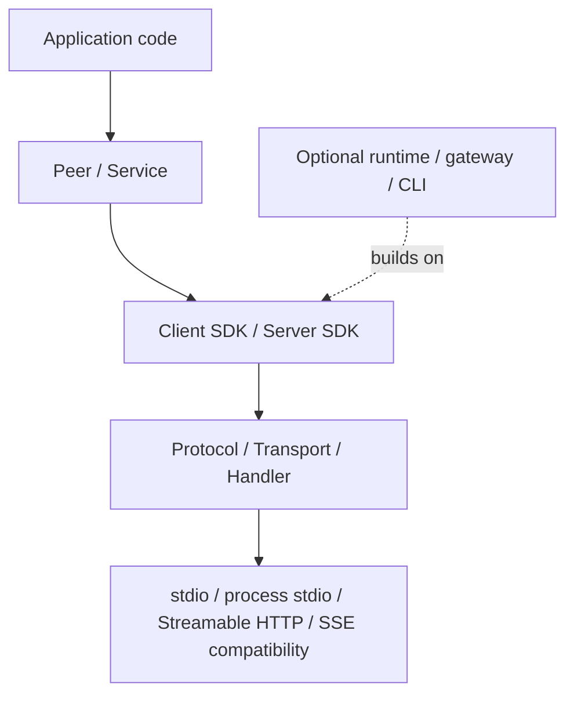

# cxxmcp

[](https://isocpp.org/)
[](https://cmake.org/)
[](https://github.com/caomengxuan666/cxxmcp/actions/workflows/release-gates.yml)
[](https://caomengxuan666.github.io/cxxmcp/)
[](LICENSE)
[](https://modelcontextprotocol.io/)
[](#作为库使用)

> 状态：`cxxmcp` 是正在准备 official SDK candidate 证据的社区 C++ MCP SDK。
> 除非被 MCP maintainers 接受或列入官方 SDK 页面，否则它不是官方 MCP SDK。

`cxxmcp` 是面向 [Model Context Protocol](https://modelcontextprotocol.io/)
client 和 server 的现代 C++17 SDK。可选 C++20 runtime、gateway、CLI 和
examples 构建在可嵌入 SDK 之上。

核心 SDK 表面保持稳定、窄、可打包：`protocol`、`transport`、`handler`、
`peer`、`service`、`client` 和 `server` 是主要库层。`app`、`gateway` 和
CLI 是构建在 SDK 之上的可选运行时工具，不进入核心 SDK 叙事。

English version: [README.md](README.md)

## 目录

- [为什么选择 cxxmcp](#为什么选择-cxxmcp)
- [快速安装](#快速安装)
- [质量信号](#质量信号)
- [能力快照](#能力快照)
- [作为库使用](#作为库使用)
- [从源码构建](#从源码构建)
- [快速开始](#快速开始)
- [Package Targets](#package-targets)
- [协议边界](#协议边界)
- [能力分类](#能力分类)
- [HTTP Transport 策略](#http-transport-策略)
- [兼容性契约](#兼容性契约)
- [Examples](#examples)
- [Release Evidence](#release-evidence)
- [文档](#文档)
- [项目状态](#项目状态)

## 为什么选择 cxxmcp

- C++17 SDK，提供 CMake package targets，并有安装后消费的 smoke coverage
- Typed MCP 协议模型，同时保留 raw JSON-RPC escape hatch
- 可嵌入的 client / server SDK，适合真实 C++ 应用集成
- RMCP 风格的 `Peer`、`Service` 和 handler boundary
- 支持 stdio、process stdio、Streamable HTTP，以及 legacy SSE 兼容路径
- 覆盖 tool、prompt、resource、completion、elicitation、sampling、task、
  progress 和 cancellation 等主要 MCP surface
- 可选 gateway / CLI runtime，用于本地 MCP server 管理和受控暴露
- 使用 package-smoke 和本地 RMCP conformance 测试作为 release gate

## 快速安装

安装本地 SDK package：

```powershell
cmake -S . -B build -DCXXMCP_BUILD_SDK=ON -DCXXMCP_BUILD_CLIENT=ON -DCXXMCP_BUILD_SERVER=ON
cmake --build build --config Release
cmake --install build --config Release --prefix out/install/cxxmcp
```

在下游 CMake 项目中消费：

```cmake
find_package(cxxmcp CONFIG REQUIRED)
target_link_libraries(my_server PRIVATE cxxmcp::server)
target_link_libraries(my_client PRIVATE cxxmcp::client)
```

Public SDK headers 和 package targets 面向 C++17。可选 runtime、gateway、
CLI、examples 和 tests 需要 C++20。

包管理器支持先从 SDK-only 契约开始：

- Conan 2 recipe：`conanfile.py`
- vcpkg overlay port：`packaging/vcpkg/ports/cxxmcp`
- xmake-repo recipe 草案：`packaging/xmake/packages/c/cxxmcp/xmake.lua`
- FetchContent / CPM.cmake 片段：
  [包消费方式](docs/package_consumption_zh.md)

这些路径只构建 C++17 SDK targets，并关闭 runtime、gateway 和 CLI。当前
vcpkg port 是用于本仓库 checkout 的 overlay port；后续进入上游 registry 时
需要固定 release URL 和 checksum。

## 质量信号

- Release gates 覆盖 public headers、package-smoke 消费、transports、
  SDK 行为，以及 RMCP / TypeScript / Python 互操作。
- Release candidate 应为精确 commit 发布 workflow artifacts、Doxygen API
  docs、source archive、checksums 和 release evidence。
- 兼容性预期记录在 [Compatibility policy](docs/compatibility_policy.md) 和
  [Release gates](docs/release_gates.md)。
- official SDK candidate 路径记录在
  [Official SDK candidate process](docs/official_sdk_candidate_process.md)。

## 能力快照

| 领域 | 当前状态 |
|---|---|
| Protocol / JSON-RPC | Typed models、序列化 helper、initialize version 校验、raw request/notification escape hatch |
| Client SDK | HTTP、stdio、process stdio、request handles、typed async helpers、roots、sampling、elicitation、tasks |
| Server SDK | Registry、typed tool helper、prompt/resource handler、task-aware tool call、notifications |
| Peer/service boundary | RMCP-like role-aware `Peer<Role>` 和 `Service<Role>` public shape |
| Transports | stdio、process stdio、Streamable HTTP、legacy SSE 兼容路径 |
| Packaging | 导出的 CMake targets、install tree 支持、package-smoke fixture |
| Runtime tools | SDK 之上的可选 app、gateway、CLI 层 |

## SDK Map



## 作为库使用

安装后的 CMake 使用方式应该像普通 SDK：

```cmake
find_package(cxxmcp CONFIG REQUIRED)

add_executable(my_client main.cpp)
target_link_libraries(my_client PRIVATE cxxmcp::client)

add_executable(my_server server.cpp)
target_link_libraries(my_server PRIVATE cxxmcp::server)
```

只有在希望一个 target 同时引入 public protocol、client 和 server SDK 层时，
才使用聚合目标 `cxxmcp::sdk`。

常用公共头文件：

```cpp
#include <cxxmcp/protocol.hpp>
#include <cxxmcp/request.hpp>
#include <cxxmcp/transport.hpp>
#include <cxxmcp/handler.hpp>
#include <cxxmcp/peer.hpp>
#include <cxxmcp/service.hpp>
#include <cxxmcp/client.hpp>
#include <cxxmcp/server.hpp>
#include <cxxmcp/sdk.hpp>
```

## 从源码构建

要求：

- CMake 3.23+
- SDK target 需要 C++17 compiler
- 构建可选 runtime、CLI、examples 或 tests 时需要 C++20 compiler

默认 SDK 构建：

```powershell
cmake -S . -B build
cmake --build build
```

显式构建 client / server SDK：

```powershell
cmake -S . -B build-sdk -DCXXMCP_BUILD_CLIENT=ON -DCXXMCP_BUILD_SERVER=ON
cmake --build build-sdk
```

构建 examples：

```powershell
cmake --preset examples
cmake --build --preset examples
```

构建并运行完整 smoke 测试：

```powershell
cmake -S . -B build-smoke -DCXXMCP_BUILD_SDK=ON -DCXXMCP_BUILD_CLIENT=ON -DCXXMCP_BUILD_SERVER=ON -DCXXMCP_BUILD_RUNTIME=ON -DCXXMCP_BUILD_TESTS=ON
cmake --build build-smoke --config Debug
ctest --test-dir build-smoke -C Debug --output-on-failure
```

安装到本地 prefix：

```powershell
cmake --install build-smoke --config Debug --prefix out/install/cxxmcp
```

## 快速开始

### 首选 Server Peer/Service

```cpp
#include <iostream>
#include <memory>
#include <utility>

#include <cxxmcp/peer.hpp>
#include <cxxmcp/server.hpp>
#include <cxxmcp/service.hpp>
#include <cxxmcp/transport/stdio_transport.hpp>

int main() {
    mcp::server::ServerBuilder builder;
    builder.name("demo-server")
        .version("1.0.0")
        .add_tool(
            mcp::protocol::ToolDefinition{
                .name = "echo",
                .description = "Echo the incoming payload",
                .input_schema = mcp::protocol::Json{{"type", "object"}},
            },
            [](const mcp::server::ToolContext& context) {
                mcp::protocol::ToolResult result;
                result.structured_content = context.arguments;
                return result;
            });

    auto server = builder.build();
    if (!server) {
        return 1;
    }

    mcp::ServerPeer peer(std::move(*server));
    peer.add_transport(
        std::make_unique<mcp::transport::ServerStdioTransport>(
            std::cin, std::cout));

    auto running = mcp::serve(std::move(peer));
    if (!running) {
        return 1;
    }

    return running->wait().has_value() ? 0 : 1;
}
```

### 首选 Client Peer/Service

```cpp
#include <memory>
#include <utility>

#include <cxxmcp/peer.hpp>
#include <cxxmcp/service.hpp>
#include <cxxmcp/transport/http_transport.hpp>

int main() {
    auto transport =
        std::make_unique<mcp::transport::StreamableHttpClientTransport>(
            mcp::transport::StreamableHttpClientTransportOptions{
                .host = "127.0.0.1",
                .port = 3000,
                .path = "/mcp",
            });
    mcp::ClientPeer peer(std::move(transport));

    auto running = mcp::serve(std::move(peer));
    if (!running) {
        return 1;
    }

    running->peer().initialize();
    running->peer().list_all_tools();
    running->peer().call_tool("echo", mcp::protocol::Json{{"value", "hello"}});
    running->stop();
}
```

### 兼容 App Builder

`server::App::builder()` 是用于紧凑 demo 和 legacy 代码的便利封装。新的 SDK
文档和示例应优先展示 `Peer` 与 `Service`。

```cpp
#include <string>

#include <cxxmcp/server.hpp>

int main() {
    return mcp::server::App::builder()
        .name("demo-server")
        .version("1.0.0")
        .instructions("Expose local tools over MCP.")
        .stdio()
        .tool<std::string, std::string>("echo", [](const std::string& text) {
            return text;
        })
        .run();
}
```

## Package Targets

| Target | 用途 |
|---|---|
| `cxxmcp::protocol` | MCP 协议模型和 JSON-RPC 序列化 |
| `cxxmcp::transport` | Role-generic transport contract 和共享 transport helper |
| `cxxmcp::handler` | Client/server handler interface 与 aggregate |
| `cxxmcp::peer` | Role-aware client/server execution boundary |
| `cxxmcp::service` | 围绕 peer 的 service lifecycle boundary |
| `cxxmcp::client` | 可嵌入 MCP client SDK |
| `cxxmcp::server` | 可嵌入 MCP server SDK |
| `cxxmcp::sdk` | 聚合 public SDK target |
| `cxxmcp::runtime` | 可选 runtime application layer |
| `cxxmcp::gateway` | 可选本地 gateway layer |
| `cxxmcp::cli` | 可选命令行工具 |
| `cxxmcp::plugin_sdk` | 可选 plugin authoring surface |
| `cxxmcp::adapters` | 可选 adapter helpers |

Runtime state、gateway profile、policy 和 CLI 默认目录不是 core SDK contract。

## 协议边界

cxxmcp 遵循 MCP JSON-RPC wire shape，不定义自研 MCP dialect，也不引入替代
wire format。常规应用代码应优先使用 tool、prompt、resource、completion、
roots、sampling、elicitation、task、progress 和 cancellation 的 typed helper。
raw JSON-RPC request / notification API 会保留，用于 vendor-specific method、
未来协议兼容和 conformance test。特殊 runtime 集成应通过 public transport
contract 上的兼容 adapter 完成，而不是扩展协议本身。

task 和 elicitation 已作为 typed SDK capability 暴露，但它们仍然是可选能力族。
只要求 core MCP parity 的 milestone 不应强制应用实现 task 或 elicitation handler，
除非该 milestone 明确覆盖这些能力。capability negotiation 和 raw JSON-RPC escape
hatch 是部分实现或未来能力的兼容路径。server-side task lifecycle 语义记录在
[Task lifecycle](docs/task_lifecycle.md)，elicitation lifecycle 和 capability
语义记录在 [Elicitation lifecycle](docs/elicitation_lifecycle.md)，request
timeout、cancellation、progress 和 shutdown 语义记录在
[Request lifecycle](docs/request_lifecycle.md)。

## 能力分类

cxxmcp 把 protocol capability 当成协商后的契约，而不是全局功能承诺。
一旦 `initialize` 的 capability 已知，typed helper 会在本地返回 protocol error，
而不是继续发送对端没有声明支持的方法。raw JSON-RPC API 仍然保留，用于 vendor
extension 和未来协议字段。

| 分类 | 能力族 | SDK 规则 |
|---|---|---|
| Core protocol | initialize、initialized、ping、JSON-RPC error、raw request/notification escape hatch、cancellation、progress、typed model / serialization layer | 始终属于 SDK contract。它们不是可选产品功能，但具体 transport 仍可能返回 transport-level failure。 |
| Core advertised server features | tools、prompts、resources、resource templates、completion、logging、resource subscribe/unsubscribe | typed helper 是稳定 public API；依赖 server capability 的 helper 会在 initialize 后按协商结果 gate。 |
| Core advertised client features | roots、sampling、elicitation、cancellation/progress callbacks | typed handler/helper 是稳定 public API；server-side `ClientPeer` helper 会按当前 client session 的 capability gate。 |
| Optional task lifecycle | task-aware tool call、task list/get/cancel/result、task status notification、支持 task 的 feature request parameters | typed protocol model 和 helper 稳定存在，但应用只有在声明或需要 task support 时才需要实现。 |
| Optional advanced interaction | elicitation form/URL flow，以及 basic request handling 之外的 sampling 细节 | typed helper 稳定存在，但实现应保持 capability-gated，并记录用户可见行为。 |
| Experimental or vendor extension | `experimental`、`extensions`、unknown JSON member、vendor-specific method | 已建模处会保留 raw JSON；在被提升为明确 capability family 前，语义不承诺为稳定 SDK 行为。 |

## 协议版本策略

cxxmcp 跟随已发布的 MCP protocol snapshot，不自定义协议版本。SDK 只声明并校验
`protocol::supported_protocol_versions()` 返回的版本。

新增 MCP snapshot 时，cxxmcp 至少在一个 minor release 内继续保留前一个已支持
snapshot，给 client 和 server 留出重叠升级窗口。移除某个 snapshot 属于 breaking
compatibility event，必须写入 release notes 和 public compatibility checklist。

不支持的版本会快速返回 protocol 或 transport validation error；SDK 不会静默降级到
未声明的 dialect。HTTP 在 initialize 之后还要求请求携带
`MCP-Protocol-Version`，initialize 请求中 header/body 版本不一致会被拒绝。

## HTTP Transport 策略

Streamable HTTP 是默认 HTTP 路径。server transport 当前采用 stateful mode：
每次成功 `initialize` 都会创建独立的 `Mcp-Session-Id`，后续 POST、GET/SSE
和 DELETE 请求都必须携带该 session id 以及 `MCP-Protocol-Version`。未知或已
删除的 session 会被当作 stale session 拒绝。

`server::HttpTransport` 当前不声明 stateless server mode。使用本 SDK 暴露
Streamable HTTP server 时，应采用上面的 stateful session contract。client
transport 仍然可以消费不返回 `Mcp-Session-Id` 的简单 HTTP MCP endpoint；这种
情况下它不会发送 session header，并把每个 POST response 作为独立响应处理。

Server-to-client request、notification、client capabilities、replay window
和 pending response 都按 session 隔离。`SessionContext::client()` 返回的
`ClientPeer` 会绑定当前 session，因此 roots、sampling、elicitation、
cancellation 和 progress notification 会路由到正确的 HTTP client。同一个
session 只接受一条实时 SSE stream；携带 `Last-Event-ID` 的 reconnect 可以在
旧 stream 收尾时 replay 已保留事件。

Legacy SSE 只作为兼容路径保留。新代码应使用 Streamable HTTP 的
POST/GET/DELETE 行为，把 raw SSE endpoint 当作 adapter 问题，而不是新的 SDK
协议。

## CMake Options

| Option | Default | Description |
|---|---:|---|
| `CXXMCP_BUILD_SDK` | `ON` | 构建聚合 public SDK 层 |
| `CXXMCP_BUILD_PROTOCOL` | `ON` | 构建 MCP protocol library |
| `CXXMCP_BUILD_CLIENT` | `OFF` | 构建 MCP client library |
| `CXXMCP_BUILD_SERVER` | `OFF` | 构建 MCP server library |
| `CXXMCP_BUILD_RUNTIME` | `OFF` | 构建 runtime application layer |
| `CXXMCP_BUILD_APP` | `OFF` | 构建 application service library |
| `CXXMCP_BUILD_GATEWAY` | `OFF` | 构建 gateway service library |
| `CXXMCP_BUILD_CLI` | `OFF` | 构建 command-line application |
| `CXXMCP_BUILD_EXAMPLES` | `OFF` | 构建 example executables |
| `CXXMCP_BUILD_TESTS` | `BUILD_TESTING` | 构建已启用层的测试 |
| `CXXMCP_BUILD_DOCS` | `OFF` | 构建 Doxygen API 文档 |

`CXXMCP_BUILD_SDK` 会启用 protocol、client 和 server 层。
`CXXMCP_BUILD_CLI` 会启用 CLI 所需的 gateway、runtime、server、client 和
protocol 层。

## Async Request Executor

Async request helper 使用一个进程级 bounded worker pool。默认是 4 个 worker、
队列大小 64，面向本地 stdio / process-stdio MCP workload。gateway、远程 HTTP
或高并发应用可以在第一次 async request 之前配置它：

```cpp
mcp::configure_request_executor(
    mcp::RequestExecutorOptions{.worker_count = 8, .max_queue_size = 256});
```

executor 初始化之后会拒绝再次配置，以保持 in-flight request 语义稳定。

## 兼容性契约

- Public SDK headers 和 package targets 默认以 C++17 编译。下游可以通过
  `CXXMCP_SDK_CXX_STANDARD` 提高语言标准，但公共头文件不能依赖更高标准。
- Release compiler matrix 是 Windows/MSVC、Linux/GCC、Linux/Clang 和
  macOS/AppleClang。某个 release 只能声明已经通过该 release public-header、
  package-smoke 和 conformance gates 的矩阵项。
- Public include path 固定在 `cxxmcp/...` 下；公共 targets 是
  `cxxmcp::protocol`、`cxxmcp::transport`、`cxxmcp::handler`、
  `cxxmcp::peer`、`cxxmcp::service`、`cxxmcp::client`、
  `cxxmcp::server` 和 `cxxmcp::sdk`。
- 源码兼容遵循语义化版本。公共 API 改名必须先添加新名字，保留旧 alias，并用
  `CXXMCP_DEPRECATED("message")` 标记，写清迁移方式，只能在下一个 major 移除。
- 在 cxxmcp 默认发布静态库期间，ABI 稳定性明确不承诺。以后如果把 shared
  library 作为稳定发布物，必须先定义 ABI policy。
- Release review 必须包含 public header diff、独立 public-header compile
  tests、安装树 `package_smoke`，以及该 release 可用的 conformance matrix。
- 完整兼容性策略记录在 [Compatibility policy](docs/compatibility_policy.md)。
  Release-blocking tests、labels，以及支持的 compiler/generator/runtime
  matrix 记录在 [Release gates](docs/release_gates.md)。

## Examples

源码树内的 `examples` preset 会构建紧凑的 SDK 入口：

- 首选 Peer/Service 示例：`server_peer`、`client_peer`、`process_stdio_client`
- 兼容和低层示例：`stdio_server`、`typed_stdio_server`、`client_loopback`、
  `task_async_client_server`
- 可选 runtime tooling 示例：`gateway_runtime`

独立的
[cxxmcp-examples](https://github.com/caomengxuan666/cxxmcp-examples)
仓库是下游应用形态的验证套件。它通过普通外部 CMake 项目消费 SDK，覆盖比源码树内
compact samples 更完整的高级 surface：direct Streamable HTTP 和 legacy SSE、
process stdio、自定义 transport、transport adapter、async request handle、
cursor pagination、subscription、server-to-client callback、task/cancellation、
plugin/adapters、gateway runtime，以及 app service management。

## 质量门槛

仓库把 SDK 级质量检查放在源码树里：

- protocol、client/server、transport、SDK、public target tests
- 安装后消费 CMake target 的 package-smoke fixture
- 本地 RMCP conformance coverage
- examples build preset
- formatting、cpplint、clang-tidy、Doxygen 和 release-evidence scripts

当前标准化工作统一记录在 [Fact-standard TODO](todo.md)。

## Release Evidence

某个 release 只能声明已经在该 release commit 通过 release-blocking 检查的
compiler、generator、runtime-library 和 platform 组合。Release evidence package
应包含：

- `cxxmcp-release-gates-*` workflow artifacts，包含 CTest logs 和 JUnit output
- `cxxmcp-doxygen-html` API 文档
- `cxxmcp-source` source archive 和 `SHA256SUMS.txt`
- `cxxmcp-release-evidence`，包含 README、changelog、compatibility policy、
  release gates、checklist、notes template、TODO 和 examples

互操作证据由 RMCP conformance coverage，以及 RMCP、TypeScript SDK、Python SDK
client 的 process-stdio fixtures 支撑。

## 文档

- [GitHub Pages 文档站](https://caomengxuan666.github.io/cxxmcp/)
- [Fact-standard TODO](todo.md)
- [Contributing](CONTRIBUTING.md)
- [Security policy](SECURITY.md)
- [Compatibility policy](docs/compatibility_policy.md)
- [Dependency and reference policy](docs/dependency_policy.md)
- [Release gates](docs/release_gates.md)
- [Release candidate checklist](docs/release_candidate_checklist.md)
- [Release notes template](docs/release_notes_template.md)
- [Official SDK candidate process](docs/official_sdk_candidate_process.md)
- [Request lifecycle](docs/request_lifecycle.md)
- [Peer/Service 迁移指南](docs/sdk_peer_service_migration.md)
- [更新日志](CHANGELOG.md)

## 项目状态

`cxxmcp` 已经是具备 RMCP-like public architecture 的 MCP C++ SDK，并且有很强
的标准 SDK 潜力。SDK-first 形态、Peer/Service boundary、内建 transport 行为
和跨 SDK conformance gates 已经接近 release candidate 状态。在 release-gates
matrix 为精确 release commit 产出可审计 artifacts，并且 release candidate
checklist 完成之前，不声明 fact-standard 状态。
